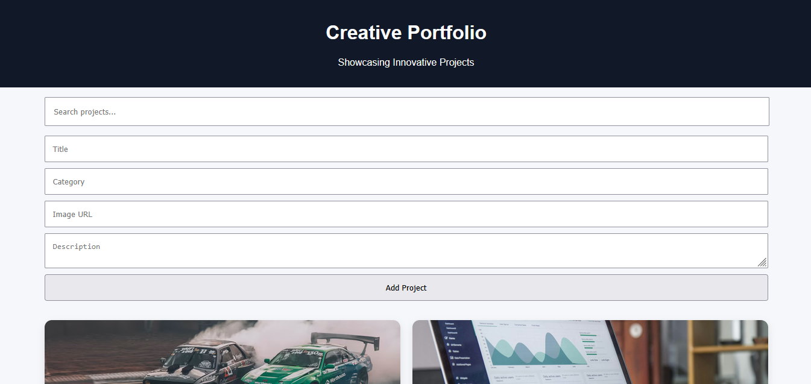

**Creative Agency Portfolio Platform**

Single Page Application built with React that showcases a creative agency's projects and allows users to add and search through projects.

**Table of Contents**

- [Overview]
- [Features]
- [Live-Demo]
- [Local-Setup]
- [Requirements]
- [Roadmap]

## Overview

The Creative Agency Portfolio Platform is a Single Page Application (SPA) built with React.

The application provides a simple platform for showcasing creative agency projects while allowing users to add new projects and search through the existing project collection.

Projects are managed using React state and displayed dynamically through reusable components.

## Features

- View creative agency projects
- Add new projects using a project form
- Search projects by title or keyword
- Real-time project filtering
- Dynamically render projects using reusable React components
- Store projects using React `useState`
- Responsive user interface
- Component-based application structure

## Live Demo

Open the application here:

https://react-creative-portfolio.netlify.app/

## Local Setup

1. Clone the repository:

bash shell
git clone https://github.com/Muchuku1/SPA-with-React-Portfolio-Platform.git

2. Navigate to the root directory:

cd SPA-with-React-Portfolio-Platform/

3. Install node modules

**npm i**

4. Run the app using:

**npm run dev**

### Requirements

- Internet Access
- A modern web browser

### Technologies Used 
- HTML5
- CSS
- React.js

### Roadmap
- Add image favorites and saved collections
- Better the UI design

